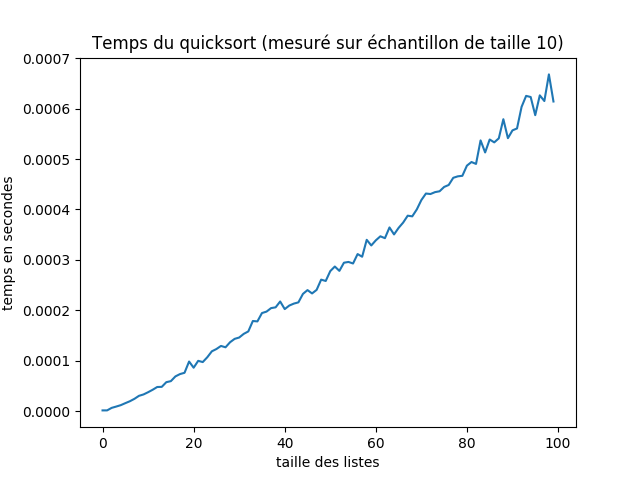

==========================
Analyse des tris récursifs
==========================

Préambule
=========

Tout le travail d'analyse doit se faire dans le fichier :file:`src/reursive_sorts_analysis.py`.

Ce fichier utilisé en tant que script principal nécessite des arguments

.. code:: bash
			  
   Usage: recursive_sorts_analysis.py <option> <sort> <max size> <sample size | case>
   avec
	   <option> = -time | -comp | -theory
	   <sort> = mergesort | quicksort
	   <max size> = max size of lists to sort
	   <sample size> = size of samples. Avalaible only for -time or -comp options
	   <case> = best | worst. Avalaible only for -theory option

Pour l'utiliser, vous devrez donc

* soit utiliser un terminal de commandes,
* soit, en utilisant Thonny, fournir les arguments  (menu `View>Program arguments`)
  Pour ce TP vous n'avez qu'à compléter quelques éléments de code.

.. topic:: À faire

   Sans rien ajouter au fichier, exécutez-le en vous trompant de multiples fois pour commencer, puis en donnant de bons arguments (bien entendu, dans ces derniers cas,  vous n'obtiendrez rien ... pour l'instant).
  
Analyse expérimentale
=====================

La première partie de l'analyse consiste à effectuer un certain nombre de mesures expérimentales :

* des mesures de temps d'abord
* des mesures de nombre de comparaisons ensuite.

Liste aléatoire
---------------
Vous allez effectuer des mesures expérimentales à partir de listes aléatoires.

.. topic:: À faire

   Commencez par compléter la fonction ``random_list(n)`` qui renvoie une liste des entiers de 0 à n-1 dans un ordre aléatoire. Pour cela vous pourrez utiliser avec profit la procédure ``random.shuffle``. 

   .. autofunction:: recursive_sorts_analysis.random_list

			
Mesure du temps d'exécution
---------------------------

Utilisation du module :mod:`timeit`.

.. code:: python

   import timeit
   timeit.timeit(setup='from __main__ import SORTS, random_list',
                 stmt='SORTS["quicksort"](random_list(100))',
                 number=10)

La fonction ``timeit`` du module du même nom prend trois paramètres :

* ``setup`` : une chaîne de caractères qui permet d'initialiser la commande qui suivra. Dans l'exemple ci-dessus, c'est l'importation du dictionnaire ``SORTS`` défini dans le module principal (``__main__``).
* ``stmt`` : une chaîne de caractères qui décrit la commande dont on doit mesurer le temps d'exécution.
* ``number`` : c'est le nombre de fois que la commande doit être exécutée. Cela permet de limiter les effets du «bruit» en moyennant. C'est à ce paramètre qu'est destiné la constante ``SAMPLE_SIZE`` (taille d'échantillon).
  
La fonction `timeit` a pour résultat le temps (en secondes) mis pour exécuter ``number`` fois ``stmt``, ``setup`` n'étant exécuté qu'une seule fois.

.. topic:: À faire

   Dans le fichier :file:`recursive_sorts_analysis.py`, réalisez la fonction ``build_times_list``

   .. autofunction:: recursive_sorts_analysis.build_times_list

   puis complétez la partie comprise entre ``if option == '-time':`` et ``elif option == '-comp':`` afin de construire une liste de temps moyens mesurés pour le tri défini par ``SORT`` sur des listes de taille variant de 0 à ``MAX_SIZE``, chacune des tailles devant être mesurées ``SAMPLE_SIZE`` fois. Vous nommerez ``TIMES`` cette liste.
   
   
Production d'un graphique
-------------------------
Le module :mod:`pyplot` de :mod:`matplotlib` permet d'obtenir un graphique. Par exemple, en supposant les listes ``SIZE`` et ``TIMES`` construites, la suite de commande qui suit produit le graphique ci-dessous.

::

   from matplotlib import pyplot as plt

   plt.plot(SIZES, TIMES)
   plt.title('Temps du quicksort (mesuré sur échantillon de taille 10)')
   plt.xlabel('taille des listes')
   plt.ylabel('nbre de comparaisons')
   plt.show()

.. topic:: À faire

   En vous inspirant du code ci-dessus, réalisez la fonction ``myplot`` que vous utiliserez ensuite systématiquement pour produire des graphiques.

   .. autofunction:: recursive_sorts_analysis.myplot

Représentation graphique des mesures de temps
~~~~~~~~~~~~~~~~~~~~~~~~~~~~~~~~~~~~~~~~~~~~~

.. topic:: À faire

   Produisez des graphiques représentant les temps mesurés pour chacun des deux tris sur des listes de taille jusqu'à 200 et des échantillons de taille 20. Sauvegardez-les au format PNG dans le dossier :file:`sourcedoc` et intégrez-les dans ce document ci-dessous (en vous inspirant du code correspondant à l'image ci-dessus.
   
		 
Mesure du nombre de comparaisons
--------------------------------

Utilisation du décorateur ``count``. Ce décorateur ajoute à la fonction qu'on lui donne un attribut ``counter`` initialisé à 0. Chaque appel à la fonction incrémente ce compteur. Ainsi après quelques utilisations de la fonction, il est possible de connaître grâce à cet attribut le nombre de fois que la fonction a été appelée.

::

   >>> from ap2_decorators import count
   >>> from recursive_sorts import compare

   >>> compare = count(compare)
   >>> compare.counter
   0
   >>> compare(1, 2)
   -1
   >>> compare(2, 2)
   0
   >>> compare(3, 2)
   1
   >>> compare.counter
   3
   >>> compare.counter = 0
   >>> compare.counter
   0

Pour compter le nombre de comparaisons effectuées dans le tri fusion d'une liste aléatoire

::

   >>> comp = count(compare)
   >>> mergesort(random_list(10), comp)
   [0, 1, 2, 3, 4, 5, 6, 7, 8, 9]
   >>> comp.counter
   20

**Remarque :** le nombre de comparaisons obtenu dans l'exemple ci-dessus peut varier selon la liste aléatoire obtenue.

.. topic:: À faire

   Dans le fichier :file:`recursive_sorts_analysis.py`, réalisez la fonction ``build_comp_number_list``.

   .. autofunction:: recursive_sorts_analysis.build_comp_number_list

   puis complétez la partie comprise entre ``if option == '-comp':`` et ``else:`` afin de construire une liste de nombres moyens de comparaisons mesurés pour le tri défini par ``SORT`` sur des listes de taille variant de 0 à ``MAX_SIZE``, chacune des tailles devant être mesurées ``SAMPLE_SIZE`` fois. Vous nommerez ``TIMES`` cette liste.
   
   
Représentations graphiques
~~~~~~~~~~~~~~~~~~~~~~~~~~

.. topic:: À faire

   Pour chacun des deux tris, produisez des graphiques représentant les nombres moyens de comparaisons calculés sur des échantillons de taille 20  pour des listes de longueurs 0 à 200.
   Intégrez ci-dessous les graphiques obtenus.
   

Analyse théorique
=================
Dans cette partie, on ne trie plus de listes aléatoires et on n'effectue plus de mesures.  On va calculer les nombres de comparaisons dans le meilleur et dans le pire des cas en fonction de la longueur de la liste.

Pour cela, il est peut-être utile de se reporter au cours sur les tris récursifs afin de se remémorer les formules de récurrence établies.

.. topic:: À faire
		   
   Réalisez les fonctions calculant le nombre de comparaisons de chacun des deux tris dans le meilleur et dans le pire des cas.

   .. autofunction:: recursive_sorts_analysis.quicksort_best_case

   .. autofunction:: recursive_sorts_analysis.quicksort_worst_case
				  
   .. autofunction:: recursive_sorts_analysis.mergesort_best_case

   .. autofunction:: recursive_sorts_analysis.mergesort_worst_case

Représentations graphiques
--------------------------

.. topic:: À faire

   Pour chacun des deux tris, et pour le meilleur et le pire des cas, produisez des graphiques obtenus à l'aide des fonctions précédentes pour des listes de longueurs 0 à 200.
   Intégrez ci-dessous les graphiques obtenus.

   
