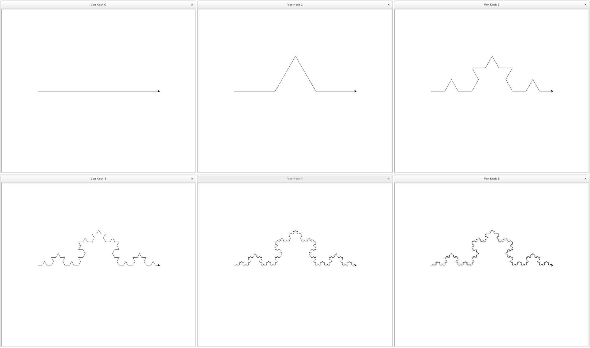

=================
Drawing fractals
=================

:doc:`back <index>`

.. automodule:: fractals

Réponses aux questions
======================
Q 2.4.2
-------
Pour la courbe de von koch, si à n+1 le tracé est de longueur l,
à n il sera de longueur l/3

Q 2.4.3
-------
Pour la courbe de Cesaro, si à n+1 le tracé est de longueur l,
à n il sera de longueur l/3 + (l-2*sin(5)*l)/2)

Q 2.4.4
-------
Pour le triangle de sierpinski, si à n+1 le tracé est de longueur l,
à n il sera de longueur l/2

Zig zag
========
.. autofunction:: zig_zag

		  
Von Koch curve
==============

.. autofunction:: courbe_von_koch 

.. _fig:all_von_koch:

	 
Von koch flake
==============
.. autofunction:: flocon_von_koch
		  

Cesaro curve
============
.. autofunction:: courbe_cesaro
		  

Cesaro square
=============
.. autofunction:: carre_cesaro

Sierpinski triangle
===================
.. autofunction:: sierpinski
